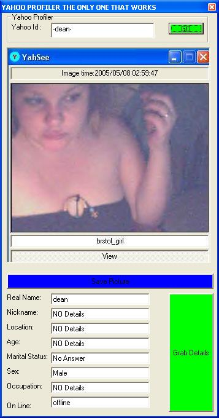



## Yahoo Profiler The Only Working One On Here At The Moment \(ALL BUGS FIXED\)

### Description

This is a yahoo profiler which uses winsock to parse the details, yahoo have changed there web pages now so all the old yahoo profile parses you see on here now DONT work. Ive made an option to save the photo if it has one.

most of this code is from other peoples code which i found on here many years ago so a big thanks to them the winsock belongs to kyro and the others i forget sorry about that peeps
 
### More Info
 

             |
---                |---
**Submitted On**   |2005-07-01 01:15:12
**By**             |[\-dean\-](https://github.com/Planet-Source-Code/PSCIndex/blob/master/ByAuthor/dean.md)
**Level**          |Beginner
**User Rating**    |4.7 (14 globes from 3 users)
**Compatibility**  |VB 3\.0, VB 4\.0 \(16\-bit\), VB 5\.0, VB 6\.0
**Category**       |[Internet/ HTML](https://github.com/Planet-Source-Code/PSCIndex/blob/master/ByCategory/internet-html__1-34.md)
**World**          |[Visual Basic](https://github.com/Planet-Source-Code/PSCIndex/blob/master/ByWorld/visual-basic.md)
**Archive File**   |[Yahoo\_Prof190771712005\.zip](https://github.com/Planet-Source-Code/dean-yahoo-profiler-the-only-working-one-on-here-at-the-moment-all-bugs-fixed__1-61434/archive/master.zip)

